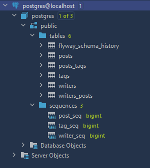

# Task

The goal is to realize a console CRUD app.
It shall action with database and shall allow to perform all CRUD operations for the next entities:

```java
Writer(id,name,List<Post> posts)
Post(id,content,List<Tag> tags, PostStatus status)
Tag(id,name)
PostStatus(enum ACTIVE,DELETED)
```

# Requirements:
 - all CRUD operations for each entity
 - MVC pattern
 - Maven shall be used for project setting
 - Hibernate shall be used for a repository layer implementation
 - annotations shall be used for Hibernate set-up
 - Flyway shall be used for database initialisation
 - Service layer shall be covered with a unit tests

Result is repo on GitHub.
Technologies: Java, PostgresSQL, Hibernate, Flyway, Maven.

### How to run this app and comments

- download this repo from GitHub and open it in IDEA
- download dependencies described in pom.xml
  - log4j dependency and "log4j.properties" file used for disabling any kind of messages in console.
- correct username, password, connection properties with your own 
- run ```mvn flyway:clean flyway:baseline flyway:migrate``` in terminal. Result is presented below:
 

- Run "StartView.class"


